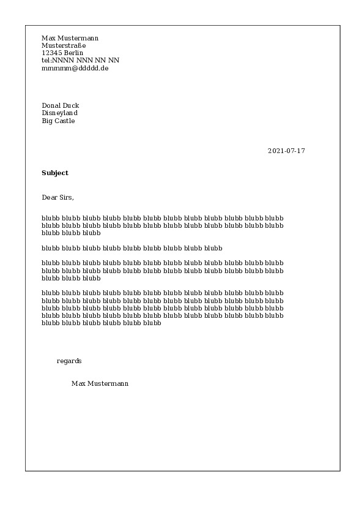
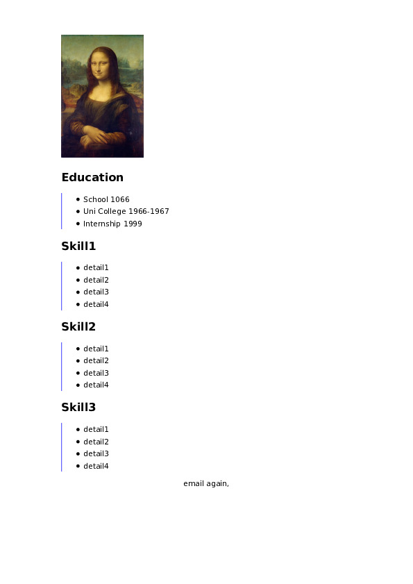

HTML Formal letter
=======

This piece of software creates formal letters and CVs using python and python's jinja2 templating.

I think this is a good idea, because html is universally supported, easy to understand and manipulate by hand should you need to.

It is also extremely flexible in terms of styling and layout.

